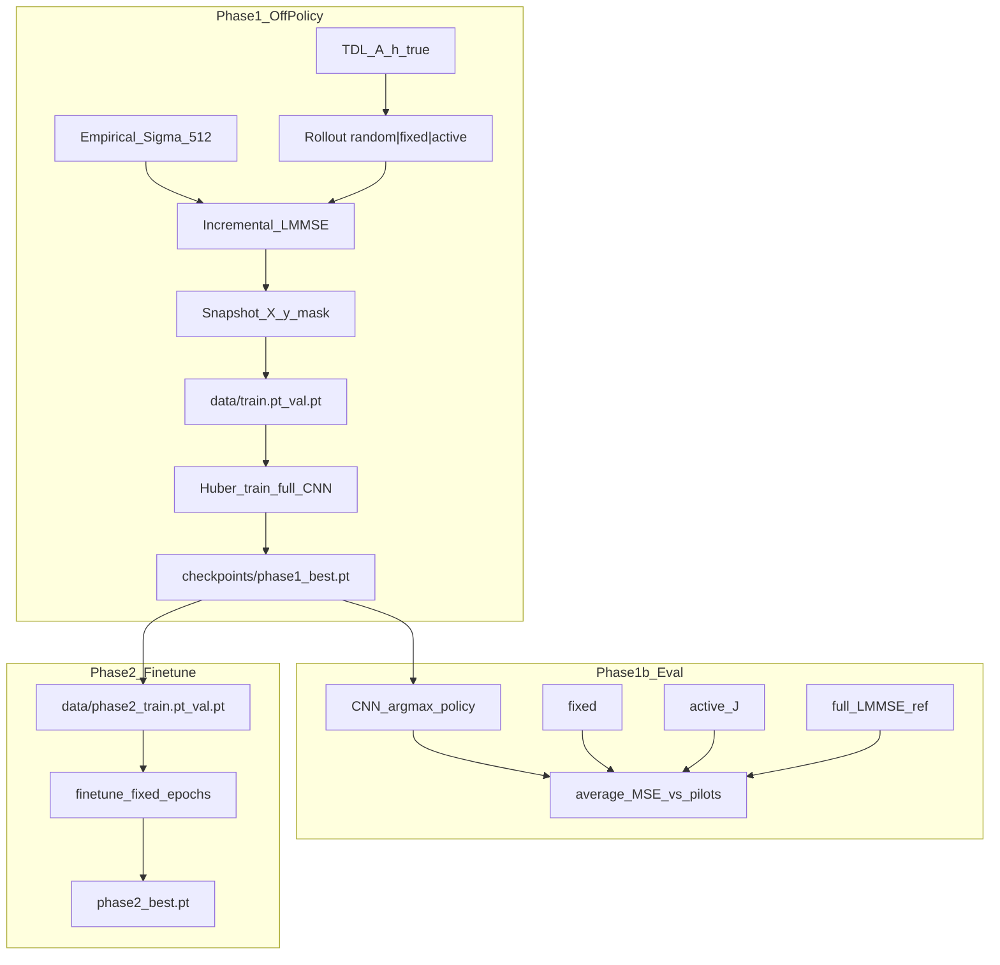
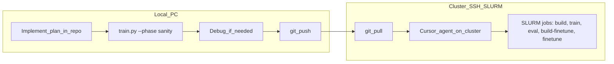

# CNN supervised training plan

## After first train — improvement #1 (unused-SC loss)

Phase 1b v1 (`phase1b_average_mse_vs_pilots_v1`) showed the CNN did not clearly beat **fixed** / **active**; a likely cause is training Huber on **all 32 SCs** while deploy uses `argmax` on **unused** SCs only. **Change:** at train time derive `loss_mask` from pilot mask channel in `X` (`unused_mask_from_features` in [`train.py`](new/error_estimators/cnn/train.py)); average Huber **per snapshot over unused SCs, then over batch** (legacy per-sample mean, not global sum/count); still save `phase1_best.pt` at lowest **val Huber** (unused-only); `y_label` and cached `.pt` `loss_mask` unchanged (no `--force-regen`). **Files:** [`train.py`](new/error_estimators/cnn/train.py) — `masked_huber_loss`, `run_epoch`, `sanity_check`; [`smoke_validation.py`](new/error_estimators/cnn/smoke_validation.py) — remove obsolete `loss_mask_all_ones` check. Re-run `train` → `eval`; compare to v1 figure. Pairwise hinge deferred if this is insufficient.

## Agreed design (from conversation + your answers)

### Role in the `new/` loop (concept only; not wired into [`simulation.py`](new/simulation.py) in this work)

- CNN predicts **per-SC current block error** (train labels use oracle `h_true`):
  - `e_k = (1/Na) ||ĥ_k − h_k||²`
- **Future deploy** (not part of training/eval here): `mean(ê_k)` for stopping vs τ; `argmax_{k∉used} ê_k` for next pilot.
- **This plan explicitly excludes threshold stopping** during dataset generation, training, and Phase 1b eval. Rollouts run until **`max_pilots = Nc = 32`** (all subcarriers eventually piloted).

### Features — `(6, Na, Nc)` float32

| Ch | Content |
|----|---------|
| 0–2 | Re(`Ĥ`), Im(`Ĥ`), `\|Ĥ\|` — **z-scored across subcarriers per snapshot** |
| 3 | Pilot mask (`1` measured, `0` else), broadcast across antenna rows |
| 4 | `log10(1/σ²)` broadcast |
| 5 | `n_pilots / Nc` broadcast |

Build `Ĥ` from `h_hat` with **vec(H) column-stack** convention from the skill (`SC k` → rows `k·Na:(k+1)·Na`).

**No `P`, no innovations** in v1.

### Model — `CNNErrorEstimator` (full 2D CNN, ~33k params)

PyTorch module class name: **`CNNErrorEstimator`** (not legacy `PilotScorerModelA`).

```text
(B, 6, 16, 32)
  Conv2d(6→32, 3×3, pad=1) → GroupNorm → GELU
  Conv2d(32→32, 3×5, pad=(1,2)) → GroupNorm → GELU
  Conv2d(32→32, 3×5, pad=(1,2)) → GroupNorm → GELU
  mean over Na (dim=2) → (B, 32, 32)
  Conv1d(32→16, k=1) → GELU → Conv1d(16→1, k=1) → (B, 32)
```

### Loss

See **Loss function (detail)** below for full math and intuition.

- Target: `y_k = log(e_k + ε)`, `ε = 1e-8`
- **Masked Huber** on all `Nc` subcarriers (`loss_mask = 1` everywhere)
- `huber_delta = 1.0` (legacy default)
- **No channel average-MSE term** in the loss (LMMSE produces `ĥ`; CNN is not trained on `(1/N)\|ĥ-h\|²` directly)

### Data generation (Phase 1)

| Setting | Value |
|---------|-------|
| Truth | TDL-A via [`channel_generators/sionna.py`](new/channel_generators/sionna.py) |
| Prior Σ for LMMSE | **Empirical Σ̂** from TDL draws, **`n_cov_mc = 512`** |
| Channels | **12,000 train / 2,000 val** |
| Rollout policy mix | **Equal thirds**: `channel_idx % 3` → random / fixed / active |
| Pilot policies | Reuse [`pilot_policy/`](new/pilot_policy/) via same rules as [`experiments/common.py`](new/experiments/common.py) `make_policy` |
| LMMSE | [`channel_estimators/lmmse.py`](new/channel_estimators/lmmse.py) incremental updates |
| Measurements | [`utils.measure_subcarrier`](new/utils.py) — **one new SC per step** (not legacy cumulative) |
| Rollout length | **`max_pilots = 32`**, **`k0 = 1`** |
| Initial pilot | **`k0 = 1`**: first pilot on a **random SC** per channel (uniform on `0..Nc-1`, seeded per channel). Not always SC 0 — avoids mask bias. |
| Snapshots | See **What is a snapshot?** below |

**Seeds** (`train.py` constants; skill-aligned where noted):

| Use | Formula |
|-----|---------|
| TDL draw | `seed + 100_000 + mc` |
| Empirical Σ̂ draw `k` | `seed + 1_000_000 + k`, `k = 0..511` |
| Random first pilot SC | `Random(channel_seed + 777_777)`; `channel_seed = seed + 100_000 + mc` |
| Phase 2 mixed-k0 branch (`ch % 4 == 0`) | `Random(channel_seed + 99).randint(1, 8)` |

**`mc` ranges** (disjoint):

| Split / phase | `mc` |
|---------------|------|
| Phase 1 train | `ch`, `ch = 0..11_999` |
| Phase 1 val | `500_000 + ch`, `ch = 0..1_999` |
| Phase 1b eval | `2_000_000 + mc`, `mc = 0..n_mc-1` |
| Phase 2 train | `3_000_000 + ch`, `ch = 0..4_999` |
| Phase 2 val | `3_500_000 + ch`, `ch = 0..999` |

**Rollout / eval noise** (`seed + offset + …`):

| Phase | Policy / use | Offset | Index |
|-------|----------------|--------|-------|
| Phase 1 build | fixed / random / active | `+0` / `+10_000` / `+20_000` | `+ mc` |
| Phase 2 build-finetune | CNN on-policy | `+30_000` | `+ channel_mc` |
| Phase 1b eval | fixed / active / cnn | `+0` / `+20_000` / `+40_000` | `+ channel_mc` |
| Phase 1b eval | full-LMMSE baseline | `+99_999` | `+ mc` (eval index, not `channel_mc`) |

**Imports constraint:** only modules under [`new/`](new/) — **no `old/`**.

**Empirical Σ̂ (implemented):** use [`estimate_empirical_sigma_tdl_a`](new/channel_generators/sionna.py) — already used by exp2/exp3. In `train.py`, call directly (no local duplicate loop):

```python
from channel_generators.sionna import SionnaOFDMGrid, estimate_empirical_sigma_tdl_a

sigma = estimate_empirical_sigma_tdl_a(
    n_antennas=cfg.n_antennas,
    n_subcarriers=cfg.n_subcarriers,
    rho_space=cfg.rho_space,
    n_cov_mc=512,
    seed=cfg.seed,
    seed_offset=1_000_000,
    reg_empirical=cfg.reg_empirical,
    grid=grid,  # or None
    device=device,
    dtype=cfg.dtype,
)
```

Build **once** at start of `--phase build` / `--phase build-finetune` and reuse for all rollouts in that run.

### Phase 1b eval (no threshold)

- **Metric:** mean **average MSE** `(1/N)\|ĥ − h_true\|²` vs number of pilots — see **MSE terminology** below
- **Baselines:** `fixed`, `active` (trace_min `J(k)`), **full LMMSE** horizontal reference
- **CNN policy:** greedy `argmax ê` on unused SCs each step; run to 32 pilots
- **Phase 1b init:** same **`k0=1` + random first SC** per test channel (shared seed across CNN / fixed / active for fair comparison)
- Reuse helpers from [`experiments/common.py`](new/experiments/common.py) where practical (`full_subcarrier_batch_true_mse`, `make_policy`, curve aggregation)

### Phase 2 fine-tune

**Separate dataset** (does not reuse or merge Phase 1 `train.pt` / `val.pt`). See **Phase 2 fine-tune data** below.

- **`--phase build-finetune`:** generate `data/phase2_train.pt` + `data/phase2_val.pt`
- **`--phase finetune`:** load Phase 2 cache + `checkpoints/phase1_best.pt` → train → `checkpoints/phase2_best.pt`
- **On-policy:** CNN (`phase1_best`) selects every pilot after bootstrap
- **Init mix:** 75% `k0=1` + random first SC; 25% `k0 ~ Uniform{1,…,8}` + `initial_subcarriers_uniform`
- Same labels, loss, `CNNErrorEstimator`
- **Phase 1 train:** fixed `max_epochs`; **`phase1_best.pt` = lowest val Huber** (no patience early-stop — see **Stopping / checkpoints**)
- **No early stopping** in Phase 2 fine-tune — fixed `max_epochs`; save `phase2_best.pt` (same rule: best val or last epoch — match Phase 1)

### Phase 3

- Hyperparameter sweep (details deferred); **early stopping on val** allowed here

---

## Folder layout

```text
new/error_estimators/cnn/
  cluster_environment.yml   # exists — cluster env model_based_pilot_allocation
  train.py                  # sole entry point; header comment documents internal sections
  data/
    train.pt              # Phase 1 off-policy
    val.pt
    phase2_train.pt       # Phase 2 on-policy (built separately)
    phase2_val.pt
  checkpoints/
    phase1_best.pt
    phase2_best.pt
    phase1_metrics.json
    phase2_metrics.json
  figures/
    phase1b_average_mse_vs_pilots.png
    phase1b_average_mse_vs_pilots.json   # curve data for replot
```

**`train.py` structure** (all logic in this file; top-of-file comment listing sections):

1. `sys.path` → repo `new/`
2. Config dataclass (`Na=16`, `Nc=32`, `sigma2=1e-2`, **`k0=1`**, `max_pilots=32`, `n_cov_mc=512`, **`max_epochs=40`**, dataset sizes, paths)
3. `build_features(h_hat, mask, n_pilots, sigma2) → (6, Na, Nc)`
4. `block_error_labels(h_hat, h_true, na, nc) → (Nc,)`
5. `CNNErrorEstimator` model
6. `masked_huber_loss`
7. Load Σ via `estimate_empirical_sigma_tdl_a` from [`channel_generators/sionna.py`](new/channel_generators/sionna.py) (`n_cov_mc=512`, `seed_offset=1_000_000`)
8. `collect_snapshots_one_channel(...)` — incremental loop matching [`simulation.py`](new/simulation.py)
9. `build_dataset_cache(split)` → save `data/{split}.pt` with `{X, y_label, loss_mask, meta}`
10. `train_loop` — **fixed `max_epochs`**; track val Huber each epoch; **save `phase1_best.pt` at lowest val Huber** (no patience early-stop)
11. `eval_phase1b` — MC curves; save **`figures/phase1b_average_mse_vs_pilots.png`** (+ JSON) under `cnn/figures/`
12. `build_finetune_cache` → `data/phase2_{train,val}.pt` (on-policy, CNN from `phase1_best`)
13. `finetune_loop` — fixed epochs, no early stop
14. `argparse`: `--phase {sanity,build,train,eval,build-finetune,finetune}`

---

## Training flow



---

## `train.py` CLI (agreed)

| `--phase` | Purpose |
|-----------|---------|
| `sanity` | Overfit one small batch locally — **local PC only** |
| `build` | Generate/cache `data/train.pt` and `data/val.pt` — **cluster job** |
| `train` | Phase 1 training → `checkpoints/phase1_best.pt` — **cluster job** |
| `eval` | Phase 1b closed-loop curves — **cluster job** |
| `build-finetune` | Generate Phase 2 on-policy cache — **cluster job** |
| `finetune` | Phase 2 fine-tune → `checkpoints/phase2_best.pt` — **cluster job** |

---

## Execution workflow (agreed next steps)



### Step 1 — Implement (local or agent)

Implement [`train.py`](new/error_estimators/cnn/train.py) and folder layout per this plan. Commit/push when ready.

### Step 2 — Sanity (local PC only)

```bash
conda activate model_based_gaussian   # local env — not cluster_environment.yml
cd <repo_root>
python new/error_estimators/cnn/train.py --phase sanity
```

Verify: loss decreases, finite grads, `CNNErrorEstimator` forward shapes. **Debug here** before cluster work.

### Step 3 — Cluster (all other phases)

On cluster via **SSH + SLURM job submission**, with a **Cursor agent** driving runs:

```bash
conda activate model_based_pilot_allocation   # from cnn/cluster_environment.yml
cd <repo_root>
# Optional smoke, then full dataset (see Cluster build smoke below)
python new/error_estimators/cnn/train.py --phase build --n-channels 10   # optional
python new/error_estimators/cnn/train.py --phase build --force-regen     # 12k/2k
python new/error_estimators/cnn/train.py --phase train
python new/error_estimators/cnn/train.py --phase eval
python new/error_estimators/cnn/train.py --phase build-finetune
python new/error_estimators/cnn/train.py --phase finetune
```

| Where | Phases |
|-------|--------|
| **Local PC** | `sanity` only |
| **Cluster (SLURM + agent)** | `build`, `train`, `eval`, `build-finetune`, `finetune` |

**Git flow:** implement locally → push → pull on cluster → agent submits/monitors jobs → pull artifacts (`data/`, `checkpoints/`, `figures/`) or inspect logs on cluster.

**Environments:**

| Machine | Conda env | Config file |
|---------|-----------|-------------|
| Local | `model_based_gaussian` | existing local setup |
| Cluster | `model_based_pilot_allocation` | [`cnn/cluster_environment.yml`](new/error_estimators/cnn/cluster_environment.yml) |

**Cluster build smoke:** optional `--n-channels 10` smoke before full 12k/2k build (agent or CLI flag). **After a successful smoke, run the full build with `--force-regen`** — otherwise `train` will cache-hit on the tiny `train.pt` / `val.pt` from smoke (10 channels each, not 12k/2k).

```bash
# Smoke (optional)
python new/error_estimators/cnn/train.py --phase build --n-channels 10

# Full Phase 1 dataset (required before train)
python new/error_estimators/cnn/train.py --phase build --force-regen
```

---

## Validation metrics (log during train/eval)

| Metric | Use |
|--------|-----|
| Val masked Huber | Log each epoch; **Phase 1 & 2:** save `*_best.pt` at **best val** (full epoch budget, no patience stop). **Phase 3 HP:** early stopping allowed |
| Top-1 on unused SCs | `argmax ê` vs `argmax e_true` — diagnostic for pilot ranking |
| Mean **average MSE** vs `n_pilots` | Phase 1b primary comparison — `(1/N)\|ĥ-h_true\|²`, not per-SC |

---

## Build phase (`--phase build`)

**What it does:** Runs many TDL-A channel rollouts through the **`new/` incremental LMMSE loop**, and writes cached tensors to [`new/error_estimators/cnn/data/`](new/error_estimators/cnn/data/):

- `train.pt` — 12,000 channels worth of snapshots
- `val.pt` — 2,000 channels worth of snapshots

Each file contains:

| Key | Shape per snapshot | Content |
|-----|-------------------|---------|
| `X` | `(6, Na, Nc)` | CNN input features |
| `y_label` | `(Nc,)` | `log(e_k + ε)` block-error targets |
| `loss_mask` | `(Nc,)` | all ones (train on every SC) |
| `meta` | dict | config, counts, seed info for cache invalidation |

**Why a separate phase:** Dataset generation is slow (Sionna + LMMSE + counterfactual-free label compute). Cache once on the cluster, then `--phase train` reloads `.pt` files quickly and reproducibly.

**Legacy data (`old/data/cnn_pilot_scorer/`): not reused** (agreed: build new). Incompatible with this project:

| | Legacy Model A | This CNN |
|---|----------------|----------|
| Features | `(7, Nc)` — antenna-averaged 1D | `(6, Na, Nc)` — full 2D |
| Labels | `log` global MSE *if pilot k chosen next* (legacy) | `log` **current** per-SC block error `e_k` |
| Rollout | Cumulative pilots, 2→8 | Incremental, one SC/step, up to 32 |
| Code | `old/` estimators, pilots | `new/` only |

Reusing legacy `.pt` would misalign inputs, targets, and pilot trajectories.

---

## What is a snapshot?

A **snapshot** = **one training example** at **one decision time** in one channel rollout.

**When it is taken:** After **`k0 = 1`** initial pilot is measured and LMMSE is updated, and **before** each next pilot is chosen — while `n_pilots < max_pilots` (32).

**What it captures:**

```text
State at time t:  ĥ_t, pilot mask, n_pilots
  → build X_t
  → compute y_k = log(e_k + ε)  for all k  (oracle, uses h_true)
  → store (X_t, y_label, loss_mask)
  → then policy picks next SC, measure, LMMSE update, repeat
```

**How many per channel:** With **`k0 = 1`**, `max_pilots = 32` → **31 snapshots** per channel (decisions before pilots 2, 3, …, 32).

**Total dataset size (approx.):**

| Split | Channels | Snapshots/channel | Total snapshots |
|-------|----------|-------------------|-----------------|
| Train | 12,000 | 31 | **~372,000** |
| Val | 2,000 | 31 | **~62,000** |

Phase 2 on-policy build produces **`data/phase2_train.pt`** and **`data/phase2_val.pt`** — separate files, same tensor schema as Phase 1.

---

## Phase 2 fine-tune data (what it is)

**What it is:** A **second dataset**, built **after** Phase 1 training, where pilot trajectories are chosen by the **trained CNN** (load `phase1_best.pt`), not by random/fixed/active.

**Why a new dataset:** Phase 1 states follow off-policy masks; CNN deploy sees **its own** pilot holes. Fine-tune teaches the error map on that distribution.

**How it is built (`--phase build-finetune`):**

1. Load `checkpoints/phase1_best.pt` (CNN in eval mode for selection).
2. Sample **new** TDL-A channels (disjoint seeds from Phase 1).
3. Bootstrap per **k0 rules** (75% / 25% mix).
4. After bootstrap: **`argmax ê` on unused SCs** for each next pilot until 32 pilots.
5. Save snapshots `(X, y_label, loss_mask)` — same labels as Phase 1 (oracle block error).

**Train / val split (agreed):**

| File | Channels | ~Snapshots (order of magnitude) |
|------|----------|----------------------------------|
| `phase2_train.pt` | **5,000** | ~155k (varies with random k0 in 25% branch) |
| `phase2_val.pt` | **1,000** | ~31k |

Split is **fixed upfront** by channel index / seed ranges (same pattern as Phase 1 `train.pt` vs `val.pt`). No overlap.

**Phase 2 channel `mc` offsets:** `3_000_000 + ch` (train), `3_500_000 + ch` (val) — passed into TDL sampler as `seed + 100_000 + mc`.

**Phase 2 measurement noise:** `seed + 30_000 + channel_mc` per rollout during `build-finetune` only (AWGN in `measure_subcarrier`). Cached snapshots in `phase2_*.pt` are fixed after build; `--phase finetune` does not re-roll noise.

**What fine-tune does NOT use:**

- Phase 1 `train.pt` / `val.pt` are **not** mixed into fine-tune batches (on-policy only).
- Phase 1 checkpoint is **initialization weights only** (+ CNN policy during `build-finetune`).

**Fine-tune training (`--phase finetune`):**

- Load `phase2_train.pt`, optimize Huber loss.
- Run **fixed `max_epochs`**; save `phase2_best.pt` at **lowest `phase2_val` Huber** (same rule as Phase 1; no patience stop).
- Patience-based early stopping deferred to **Phase 3** HP tune.

---

## Stopping / checkpoints (agreed)

**Why not patience early-stop in Phase 1?**

- Val Huber on per-SC log-error is a **proxy**; Phase 1b cares about **closed-loop average MSE vs pilots** — they can diverge.
- ~372k snapshots vs ~33k params → **underfitting** is often the risk; stopping early may cut training short.
- Matches Phase 2 philosophy: run the full epoch budget, pick weights afterward.

**Phase 1 & 2 rule (agreed):**

```text
Train all max_epochs
Each epoch: compute val masked Huber
Save checkpoint when val Huber improves → *_best.pt
No stop when val plateaus
```

**Phase 3 HP tune:** patience early-stop on val is allowed (details later).

---

## k0 choice (agreed)

| Decision | Rationale |
|----------|-----------|
| **`k0 = 1` fixed** | Supports future deploy starting from a single pilot; one extra snapshot vs `k0=2`. |
| **Random first pilot SC** | With `k0=1`, `initial_subcarriers_uniform(1, Nc)` would always be `[0]` — too biased. Instead: draw first SC uniformly per channel (deterministic from channel seed). |
| **Not random k0 in Phase 1** | Keeps 31 snapshots/channel and simpler cache; all Phase 1 channels use `k0=1` + random first SC. |

**Bootstrap loop (Phase 1):** measure random `k_init` → `lmmse_initial_update` → snapshots + policy-driven pilots 2…32.

**Phase 2 fine-tune — mixed k0 (agreed):** On-policy rollouts only; **generalization boost** without changing Phase 1 cache.

| Fraction | Init rule |
|----------|-----------|
| **75%** of Phase 2 channels | Same as Phase 1: `k0=1`, **random first pilot SC** (seeded) |
| **25%** of Phase 2 channels | Sample **`k0 ~ Uniform{1,…,8}`**, place initial pilots with **`initial_subcarriers_uniform(k0, Nc)`** from [`pilot_policy/base.py`](new/pilot_policy/base.py) |

- Channel index or seed decides which branch (deterministic, e.g. `channel_idx % 4 == 0` → random-k0 branch).
- Snapshots per channel in Phase 2 cache: **`32 - k0`** (varies from 24 to 31 in the 25% branch; 31 in the 75% branch).
- CNN still selects all pilots after bootstrap in on-policy rollouts.

**Note:** `new/` experiments default `k0=2`; CNN `train.py` rollouts use the rules above only inside `new/error_estimators/cnn/` (does not change global `ExpRunConfig` defaults).

---

## Loss function (detail)

### Step 1 — Oracle labels (dataset build only)

At each snapshot, with current LMMSE estimate `ĥ` and true channel `h_true`:

\[
e_k = \frac{1}{N_a}\|\hat h_k - h_k\|^2,\qquad
y_k = \log(e_k + \varepsilon),\quad \varepsilon = 10^{-8}
\]

- `e_k` is **per-SC block error** (average MSE over antennas at SC `k`).
- Log compresses dynamic range (errors can span orders of magnitude across pilot counts / SCs).
- `ε` avoids `log(0)` when a block is perfect.

CNN predicts `\hat y_k` for all `k` (shape `(N_c,)` per snapshot).

### Step 2 — Per-subcarrier error (Huber)

For each subcarrier `k`, residual `r_k = \hat y_k - y_k`:

\[
\text{Huber}_\delta(r) =
\begin{cases}
\frac{1}{2} r^2 & |r| \le \delta \\
\delta\left(|r| - \frac{1}{2}\delta\right) & |r| > \delta
\end{cases}
\qquad \delta = 1.0
\]

| Region | Behavior | Why |
|--------|----------|-----|
| Small `\|r\|` | quadratic (like MSE) | smooth gradients, fine fit |
| Large `\|r\|` | linear (like MAE) | outliers / very bad SCs don’t dominate |

Compared to MSE on log-errors: one SC with huge `r` contributes ~linearly, not quadratically.

Compared to pure MAE: small errors still get strong quadratic pull to match labels.

### Step 3 — Mask and average over subcarriers

`loss_mask[k] ∈ {0,1}`. **Agreed: all ones** → every SC counts equally:

\[
L_{\text{sample}} = \frac{1}{N_c}\sum_{k=0}^{N_c-1} \text{Huber}_\delta(\hat y_k - y_k)
\]

Legacy used `mask=1` only on **unused** SCs; here measured SCs also contribute (often small `e_k` after piloting that SC).

### Step 4 — Batch loss (what backprop uses)

For minibatch size `B` (independent snapshots):

\[
L_{\text{batch}} = \frac{1}{B}\sum_{b=1}^{B} L_{\text{sample}}^{(b)}
\]

Snapshots from different channels / times are **i.i.d. samples** in the DataLoader (not full trajectories per batch).

### What is *not* in the loss

| Term | In loss? |
|------|----------|
| Per-SC Huber on `log(e_k+ε)` | **Yes** — only training objective |
| **Average MSE** `(1/N)\|ĥ-h\|²` | **No** — diagnostic / Phase 1b only |
| **NMSE** `\|ĥ-h\|²/\|h\|²` | **No** |
| Ranking / top-1 pilot accuracy | **No** — logged on val, not optimized |
| `tr(P)/N` | **No** |

Future deploy: `mean_k exp(\hat y_k) ≈ mean_k e_k` = average MSE; training in log space still ranks high-error SCs correctly (`log` is monotone).

### Validation metric (same Huber, no grad)

Each epoch on `val.pt`: compute the same `L_batch` on held-out snapshots. **Phase 1:** save `phase1_best.pt` at lowest val Huber over full `max_epochs` (no patience stop).

---

Use these names consistently in docs, plots, and logs for this CNN work:

| Term | Formula | Notes |
|------|---------|--------|
| **Per-SC block error** `e_k` | `(1/N_a)\|\hat h_k - h_k\|^2` | CNN training label → `log(e_k + ε)` |
| **Average MSE** | `(1/N)\|\hat h - h_{\text{true}}\|^2 = (1/N_c)\sum_k e_k` | **Phase 1b eval curves**; primary channel-quality metric |
| **NMSE** (normalized MSE) | `\|\hat h - h_{\text{true}}\|^2 / \|h_{\text{true}}\|^2` | **Only** when explicitly normalized by `\|h_{\text{true}}\|^2` — **not used** in Phase 1 build/train/eval unless added later |
| **Model-based MSE** | `tr(P) / N` | `active` baseline / `trace_min` only — not CNN labels |

**Code note:** [`utils.empirical_nmse`](new/utils.py) and `RunTrace.nmse_true` in the skill compute **average MSE** `(1/N)\|ĥ-h\|²` despite the `nmse` name. CNN `train.py` logs/plots should say **average MSE**.

**Phase 1b:** After each pilot, compute **average MSE** `(1/N)\|ĥ-h_true\|²`, average over MC test channels, plot vs `n_pilots` (exp2-style). Not per-SC CNN output, not `tr(P)/N`, not NMSE unless normalization is explicitly added.

---

## Out of scope (explicit)

- Threshold stopping / τ tuning
- Wiring CNN into [`simulation.run_until_threshold`](new/simulation.py) or new `pilot_policy/cnn.py` (follow-up after 1b)
- Phase 3 hyperparameter sweep details
- Any `old/` imports, legacy Model A weights, or legacy `data/cnn_pilot_scorer/*.pt` caches
- Innovation channels, covariance features, counterfactual labels

---

## Implementation order

**Local (after implement):**

1. `sanity` — overfit one batch; debug until pass

**Cluster (agent + SLURM, after git pull):**

2. `build` — optional smoke `--n-channels 10`, then **full build with `--force-regen`** (12k/2k)
3. `train` — Phase 1, 40 epochs
4. `eval` — Phase 1b, `n_mc=100`
5. `build-finetune` — on-policy Phase 2 cache
6. `finetune` — Phase 2, 40 epochs
7. Phase 3 planning after reviewing 1b curves

---

## `train.py` console output and artifacts (by phase)

All paths relative to [`new/error_estimators/cnn/`](new/error_estimators/cnn/).

### `--phase sanity` (**local PC only**)

**Prints:** device; overfit batch size; per-epoch train Huber (few epochs); confirmation that loss decreases and grads are finite.

**Saves:** nothing (default **no save**).

**Not run on cluster** — fast CPU/GPU check before submitting heavy jobs.

---

### `--phase build`

**Prints:**

- Resolved CUDA device (from `utils.resolve_device`)
- Empirical Σ̂: `n_cov_mc=512`, seed offset `1_000_000`, elapsed time
- Per-split progress: log **every 500 channels** (not every channel), e.g. `train channel 5000/12000, 155000 snapshots`; always log split start/end and final summary
- Final summary: `train.pt` / `val.pt` paths, `#snapshots`, tensor shapes, `meta` keys

**Saves:**

| File | Contents |
|------|----------|
| `data/train.pt` | `X`, `y_label`, `loss_mask`, `meta` (12k channels × ~31 snapshots) |
| `data/val.pt` | same schema (2k channels) |

`meta` includes: `n_antennas`, `n_subcarriers`, `sigma2`, `n_cov_mc`, `k0`, `max_pilots`, `seed`, `split`, `n_channels`, `n_snapshots`, dtype, feature layout — for cache invalidation on rebuild.

**Smoke then full build:** `--n-channels N` writes small `train.pt` / `val.pt` to the same paths as production. `--phase build` skips regeneration when those files exist unless `--force-regen` is set. After smoke passes, always run `--phase build --force-regen` before `--phase train`.

---

### `--phase train` (Phase 1)

**Prints:** each epoch `001/040`: `train_huber`, `val_huber`, `val_top1_unused`; marker on new best val; final best epoch and paths.

**Training:** **`max_epochs=40`** (Phase 1 and Phase 2 fine-tune); no patience early-stop.

**Saves:**

| File | Contents |
|------|----------|
| `checkpoints/phase1_best.pt` | `model_state_dict`, `cfg` dict, `best_epoch`, `best_val_huber`, `best_val_top1`, `arch` (`CNNErrorEstimator` width/depth) |
| `checkpoints/phase1_metrics.json` | per-epoch list: `{epoch, train_huber, val_huber, val_top1}` |

Weights: epoch with **lowest `val_huber`** over full `max_epochs` (no patience stop).

---

### `--phase eval` (Phase 1b)

**Prints:** checkpoint loaded; `n_mc` test channels; per-policy mean **average MSE** at `n_pilots=32` (and optionally at mid points); full-LMMSE reference scalar; output figure path.

**Saves:**

| File | Contents |
|------|----------|
| `figures/phase1b_average_mse_vs_pilots.png` | semilogy: **average MSE** vs `n_pilots` for `cnn`, `fixed`, `active`; horizontal line **full LMMSE** |
| `figures/phase1b_average_mse_vs_pilots.json` | numeric curves + metadata (`n_mc`, seeds, checkpoint path, policies) |

Default eval: **`n_mc=100`** test channels (disjoint seeds from train/val), `k0=1` + shared random first SC per channel across policies. Full-LMMSE horizontal line = **MC mean** over the same `n_mc` channels (`run_mc_mean_full_true_lmmse_mse`).

---

### `--phase build-finetune`

**Prints:** same style as `build`; notes CNN policy from `phase1_best.pt`; 75%/25% k0 mix counts.

**Cache:** skips rebuild if `data/phase2_train.pt` and `data/phase2_val.pt` exist (use `--force-regen` to rebuild), same as Phase 1 `build`.

**Saves:**

| File | Contents |
|------|----------|
| `data/phase2_train.pt` | on-policy snapshots, 5k channels |
| `data/phase2_val.pt` | on-policy snapshots, 1k channels |

---

### `--phase finetune` (Phase 2)

**Prints:** same epoch lines as Phase 1 train, on `phase2_train.pt` / `phase2_val.pt`.

**Saves:**

| File | Contents |
|------|----------|
| `checkpoints/phase2_best.pt` | same schema as `phase1_best.pt` |
| `checkpoints/phase2_metrics.json` | per-epoch metrics on Phase 2 val |

Initialize weights from `checkpoints/phase1_best.pt`. Best checkpoint = lowest `phase2_val` Huber.

---
