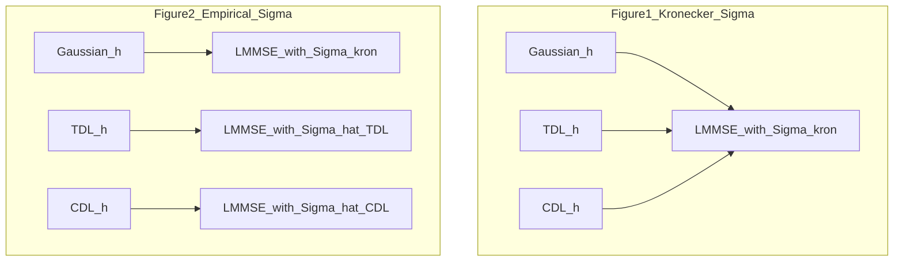

# experiment1: Gaussian vs TDL-C vs CDL-C MSE curves

## Goal

Run **`experiment1`** from [`main.py`](c:\Users\talpa\Projects\model_based_gaussian\main.py) and produce **two** semilogy MSE-vs-step figures (mean over MC). **Each figure has exactly six curves:** **Gaussian / TDL / CDL** × **fixed / active** pilot allocation (same six combinations on both figures; only the **`Sigma` used in LMMSE/active scoring** differs between figures). **No live heatmap** (`on_step=None`; do not construct [`_LiveHeatmap`](c:\Users\talpa\Projects\model_based_gaussian\main.py)).

## Dimensions and schedule (faster run)

| Setting | Value | Notes |
|---------|-------|-------|
| `Na` | **16** | Antennas per pilot subcarrier |
| `Nc` | **32** | Subcarriers; `N = 512` |
| `rho_space`, `rho_freq` | keep current defaults (e.g. 0.8 / 0.85) | Kronecker prior only |
| `sigma2` | `1e-2` | unchanged |
| Pilots | **`initial=2`**, **`final=8`**, `add/step=1`, cumulative | `T = ceil((8-2)/1) = 6` new-observation steps → **7** MSE points (`t = 0..6`) |
| `n_mc` | **50** default (smoke **10**; noisy curves → **100–200**) | **Test** trajectories: one new `h_true` per trial per channel family; MSE curves are **mean over `n_mc`** |
| `n_cov_mc` | **300** default (range **200–500**) | **Only** for **`Sigma_hat_TDL` / `Sigma_hat_CDL`** in Fig.2; **not** the plotted MSE average |

### Monte Carlo budget (what generates how many channels)

Two independent counts:

- **`n_mc` (test):** For each channel family (Gaussian / TDL / CDL), run **`n_mc`** independent channel realizations. Each trial draws one static `h_true`, then runs the full pilot sequence (fixed and active are two estimators on the **same** `h_true` and noise seeds). **Figure 1 and Figure 2 should reuse the same test draws** and differ only in which `Sigma` is passed to LMMSE/active scoring — do **not** double `n_mc` across figures.
- **`n_cov_mc` (covariance only):** Before the test loop, draw **`n_cov_mc`** TDL and **`n_cov_mc`** CDL channels **only** to form **`Sigma_hat_TDL`** and **`Sigma_hat_CDL`**. These samples are **not** averaged into the MSE curves. Gaussian **never** uses an empirical `Sigma` in Fig.2.

**Sionna channel draws (order of magnitude):** `2·n_cov_mc` (covariance) + `2·n_mc` (test TDL+CDL). Gaussian test channels use the existing analytic generator, not Sionna. Example at `n_cov_mc=300`, `n_mc=50`: **700** Sionna matrices total per full `experiment1` run.

**Choosing `n_mc`:** Controls Monte Carlo error on the **plotted** mean MSE (standard error often scales like `1/√n_mc`). `10` is fine for a quick sanity check; **`50`** is a reasonable default at `N=512`; use **`100–200`** if curves look jagged or you need tighter comparisons between the six lines.

**Choosing `n_cov_mc`:** Controls stability of **`Sigma_hat`** (`512×512`). Too small → noisy prior, Fig.2 active pilots can wobble; **`200–500`** is a practical band at this size. Increasing `n_cov_mc` does **not** smooth the MSE curves unless you also increase `n_mc`.

Sionna OFDM grid: `fft_size=32`, `subcarrier_spacing=15e3`, `bandwidth=480e3`, static CIR (`num_time_steps=1`, `min_speed=max_speed=0`). TDL-C: `rx_corr_mat=exp_corr_mat(rho_space, 16)`. CDL-C: `bs_array` **1×16** ULA, single omni, uplink. Per-realization power normalize `H` to unit mean `|H_{i,k}|^2` before noise.

## Two estimator / prior regimes

### Figure 1 — fixed Kronecker `Sigma` (model mismatch on Sionna)

- Build **`Sigma_kron = kron(R_freq, R_space)`** once from [`exponential_covariance`](c:\Users\talpa\Projects\model_based_gaussian\data_generator.py) + `1e-9 I` (same as current [`main()`](c:\Users\talpa\Projects\model_based_gaussian\main.py)).
- **All six curves** use **`Sigma_kron`** in [`sequential_lmmse_mse_curve`](c:\Users\talpa\Projects\model_based_gaussian\pilots.py) and in [`ActivePilotSampler`](c:\Users\talpa\Projects\model_based_gaussian\pilots.py) scoring via `P`.
- **Truth:** Gaussian uses two-sided coloring; TDL/CDL use Sionna static `H` → `h = H.T.contiguous().view(N,1)`.
- **Readout:** how much worse Sionna channels are when the **prior is wrong**.

### Figure 2 — empirical `Cov(h)` for Sionna only (Gaussian keeps Kronecker)

- **Before** the test MC loop, draw **`n_cov_mc`** independent `h` per Sionna family (TDL and CDL separately, same generator settings as test).
- **`Sigma_hat = (1/K) Σ_k h_k h_k^H`**, Hermitian symmetrize, add **`1e-9 I`** (match repo Cholesky habit).
- **TDL test trajectories:** LMMSE + active scores use **`Sigma_hat_TDL`** (from TDL draws only).
- **CDL test trajectories:** LMMSE + active scores use **`Sigma_hat_CDL`** (from CDL draws only).
- **Gaussian test trajectories:** unchanged **`Sigma_kron`** from `rho_space` / `rho_freq` — **not** replaced by an empirical covariance (matched model / reference).
- **Readout:** how much of the Fig.1 gap is **covariance mismatch** on Sionna vs **non-Gaussianity**; Gaussian curve is the same prior as in Fig.1, only Sionna curves change estimator `Sigma`.

## Per-scenario MC loop (shared driver)

Refactor [`main()`](c:\Users\talpa\Projects\model_based_gaussian\main.py) into a small driver used by both the legacy experiment and `experiment1`:

1. Resolve device/dtype; build `Sigma_kron`, `L_space`, `L_freq`, `PilotScheduleConfig`, `T`, `FixedPilotSampler`, `ActivePilotSampler` (active needs `sigma2`).
2. For each `mc` and channel family:
   - Sample `h_true` (Gaussian coloring or Sionna `H`).
   - **Fixed:** `sequential_lmmse_mse_curve(Sigma_used, h_true, …, fixed.vec_indices_at_step, on_step=None)`.
   - **Active:** separate `torch.Generator` seed offset (`seed + 10_000 + mc`); `sequential_lmmse_mse_curve(Sigma_used, …, active.vec_indices_at_step, on_step=None)`.
3. Accumulate `(n_mc, T+1)` tensors per **(family, policy)**; plot **mean over MC** vs `t = 0..T`.

**Seeds:** `seed + mc` for channel/noise on fixed path; active path keeps the `+10_000` offset. Use **disjoint** seed blocks for covariance estimation vs test MC.

**Optional:** keep recursive-vs-batch check for **Gaussian + fixed** only (one trial) to avoid tripling cost.

## Plotting contract

- **Figure 1** (`figures/experiment1_mse_kronecker.png`): title notes **Kronecker `Sigma`** for all; x-axis **time step `t`**; y-axis **`(1/N)||h_hat - h||^2`** (same as [`_mse`](c:\Users\talpa\Projects\model_based_gaussian\pilots.py)).
- **Figure 2** (`figures/experiment1_mse_empirical.png`): title notes **empirical `Sigma` for TDL/CDL**, Kronecker for Gaussian.
- **Colors:** one per channel family (Gaussian / TDL / CDL).
- **Linestyle:** solid = fixed, dashed = active (legend lists all six).
- `plt.savefig` + `plt.show()`; print mean final-step MSE per curve.

## Code layout (minimal scope)

| Piece | Location |
|-------|----------|
| Sionna TDL/CDL → `H (16,32)` | new [`sionna_channels.py`](c:\Users\talpa\Projects\model_based_gaussian\sionna_channels.py) |
| `empirical_covariance(h_samples)` | [`data_generator.py`](c:\Users\talpa\Projects\model_based_gaussian\data_generator.py) or next to Sionna helper |
| `experiment1(cfg)` + plotting | [`main.py`](c:\Users\talpa\Projects\model_based_gaussian\main.py) |
| `__main__` | call `experiment1(ExperimentConfig(...))` with `n_antennas=16`, `n_subcarriers=32`, `initial_pilot_subcarriers=2`, `final_pilot_subcarriers=8` |
| Dependency | document/install **`sionna`** |

Legacy `main(cfg)` stays available; heatmap remains **off** in `experiment1` only.

## Success criteria

- Six stable mean MSE curves per figure at `16×32`.
- Fig.1: TDL/CDL typically **≥** Gaussian MSE under **`Sigma_kron`**.
- Fig.2: TDL/CDL curves **move toward** Gaussian; residual gap = non-Gaussian / mean / dynamics (static `H` should leave mainly non-Gaussianity).
