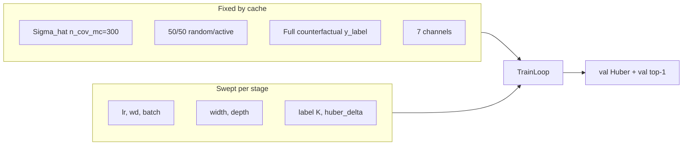
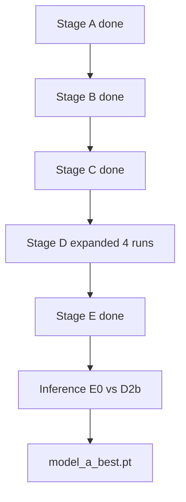

# Phase 2 — CNN pilot scorer hyperparameter sweep (completed)

## Status summary

| Item | State |
|------|--------|
| Phase 1 cache | Done — `data/cnn_pilot_scorer/{train,val}.pt` |
| Code (sweep infra) | Done — [`train_cnn_pilot_allocator.py`](train_cnn_pilot_allocator.py) |
| Stages A–E | Done — see [Full results](#full-results-resultscsv) |
| Stage F (lr refinement) | **Skipped** — `stage_f.jsonl` exists but not run; E0 already best val Huber |
| Final model | **Not promoted yet** — compare `E0/best.pt` vs `D2b/best.pt` in closed-loop inference |
| Phase 1 baseline | `best_val_huber=0.0434`, `best_val_top1≈0.248` @ epoch 14 |

**Selection rule used:** lowest **best val Huber** per stage for `winners.yaml`; tie-break **val top-1**. For deploy, also compare **closed-loop TDL-A MSE** (val top-1 can disagree with Huber — see Stage C/D).

---

## Prerequisite — Phase 1

- Job 17634546 on `dt-2080-14`: built cache (~70 min train + ~10 min val gen), trained default 64×3.
- Baseline: `checkpoints/model_a_phase1_best.pt`, metrics in `checkpoints/model_a_phase1_metrics.json`.
- CNN already beat fixed/active on TDL-A in informal eval before sweep.

**Caches (fixed for entire sweep):**

- `data/cnn_pilot_scorer/train.pt` — 72k snapshots, `(7, 32)` features  
- `data/cnn_pilot_scorer/val.pt` — 12k snapshots  

Sweep uses **cache only** — no `--force-regen`. Dataset-defining meta is checked via `CACHE_DATASET_META_KEYS` in code (excludes training-only fields like `huber_delta`).

---

## What was implemented (matches plan intent)

All items from the original “What to implement” section are in [`train_cnn_pilot_allocator.py`](train_cnn_pilot_allocator.py):

| Planned | Implemented |
|---------|-------------|
| `PilotScorerModelA(width, depth)` + `GroupNorm` groups | Yes — `group_norm_groups(width)`; depth ≥ 2, kernels `[5,5]` + `(depth-2)×3` |
| `train_loop` shared by Phase 1 and sweep | Yes |
| `load_cached_datasets()` | Yes — fails fast if cache missing / meta mismatch |
| `SweepTrainConfig` — max 35 epochs, min 5, patience 5 | Yes |
| `max_train_label_sc` — train-only mask subsampling | Yes — `subsample_train_label_mask()` |
| `sweep` subcommand — JSONL + `--index` | Yes — `run_sweep()` |
| `sweep-pick` — winner + optional `regenerate_stage_jsonl` | Yes — stages B, C, D, E presets |
| `results.csv` append per run | Yes — `checkpoints/sweep/results.csv` |
| Per-run `checkpoints/sweep/{run_id}/best.pt` + `metrics.json` | Yes |
| Checkpoint payload: `model_arch`, `cfg` | Yes — `load_checkpoint()` restores width/depth |
| CLI: `--weight-decay`, `--width`, `--depth`, etc. | Yes on `train`; sweep via JSONL |

**Repo layout (as run):**

```text
checkpoints/sweep/
  stage_a.jsonl … stage_e.jsonl   # stage_f.jsonl optional, not run
  winners.yaml
  results.csv
  {run_id}/best.pt, metrics.json
sweep.ssh                         # SLURM array driver
checkpoints/sweep/README.md       # submit cheat sheet
inference_cnn_pilot_allocator.py  # closed-loop eval (uses .pt only)
```

**Inference needs only `best.pt`** — not `metrics.json`. `load_checkpoint()` reads weights + `cfg` + `model_arch` from the `.pt` file.

---

## Deviations from original plan

### 1. Stage D expanded (4 runs, not 2)

**Plan:** Fix architecture from Stage C; sweep only `max_train_label_sc` ∈ {all, 16}.

**Actual:** After Stage C, **C8** (128×4) had best val **top-1 (0.256)** while **C4** (64×3) had best val **Huber (0.0430)**. Stage D was expanded to **2×2 grid**:

| run_id | width×depth | max_train_label_sc |
|--------|-------------|---------------------|
| D0 | 64×3 | null (all) |
| D1 | 64×3 | 16 |
| D2 / D2b | 128×4 | null |
| D3 | 128×4 | 16 |

`stage_d.jsonl` today: D0, D1, D2b, D3 (D2 folder from earlier run).

### 2. Duplicate `run_id` incident (important)

Early Stage D submit used **wrong `run_id`s** (reused D0/D1 for 128×4 lines). Effects:

- Best **top-1 ≈ 0.262** run (job 17658304 task 2) logged as **`run_id=D2` in CSV** but saved under **`checkpoints/sweep/D0/best.pt`** with log prefix `sweep D0`.
- That checkpoint was **overwritten** when the real **64×3 D0** run completed later.
- **`checkpoints/sweep/D2/best.pt`** is a **different** training (val top-1 **≈ 0.252**, epoch 6 per `D2/metrics.json`).
- **`results.csv` `checkpoint_path` for row D2** still says `D0/best.pt` — **do not trust CSV paths**; trust `{run_id}/metrics.json` next to the `.pt` you load.

**Recovery:** `D2b` rerun with clean `run_id` → `checkpoints/sweep/D2b/best.pt` (top-1 ≈ 0.252).

### 3. Stage E + `huber_delta` cache bug (fixed)

**Plan:** Sweep `huber_delta` without regen.

**Issue:** `meta_matches` initially included `huber_delta` → E0/E2 failed at cache load; E1 (`huber=1.0`) worked.

**Fix:** `CACHE_DATASET_META_KEYS` omits `huber_delta` (training-only). E0/E2 re-run after fix.

### 4. GPU / SLURM (Pascal vs Turing)

**Issue:** Array tasks on `cs-1080-*` / mixed `ise-pheno-*` got GTX 1080 / 1080 Ti (sm_61); PyTorch build requires sm_75+.

**Mitigations in [`sweep.ssh`](sweep.ssh):**

- `#SBATCH --constraint=rtx_2080|rtx_3090|rtx_4090|rtx_6000|rtx_pro_6000|l40s`
- `#SBATCH --gres=gpu:rtx_3090:1` (avoid generic `--gpus=1` on mixed nodes)
- `set -e` + preflight Python GPU CC check (exit before training if Pascal)

Stage A indices 0–5 failed once; retry with constraint succeeded.

### 5. Stage F not run

`stage_f.jsonl` still has old 64×3 / `batch=128` template. Skipped after E: **E0** best val Huber **0.0419** already beats Phase 1; narrow lr grid unlikely to beat closed-loop eval need.

### 6. `sweep-pick` on login node

Requires conda env (`torch`). Often updated `winners.yaml` / jsonl **manually** from `results.csv` instead of `python train_cnn_pilot_allocator.py sweep-pick`.

---

## Staged winners (by val Huber per stage)

Values from [`checkpoints/sweep/results.csv`](checkpoints/sweep/results.csv). **Bold** = stage winner (lowest Huber in that stage).

### Stage A — optimizer (9 runs) — `sbatch --array=0-8`

Fixed: `batch=128`, 64×3, all labels, `huber=1.0`.

| run_id | lr | wd | best val Huber | val top-1 | checkpoint |
|--------|-----|-----|--------------|-----------|------------|
| A6 | 3e-4 | 1e-3 | **0.04279** | 0.243 | `A6/best.pt` |
| A1 | 1e-3 | 0 | 0.04319 | **0.250** | `A1/best.pt` |
| A0 | 3e-4 | 0 | 0.04373 | 0.223 | `A0/best.pt` |
| A3 | 3e-4 | 1e-4 | 0.04352 | 0.232 | `A3/best.pt` |
| A5 | 3e-3 | 1e-4 | 0.04355 | 0.242 | `A5/best.pt` |
| A8 | 3e-3 | 1e-3 | 0.04363 | 0.240 | `A8/best.pt` |
| A2 | 3e-3 | 0 | 0.04407 | 0.245 | `A2/best.pt` |
| A7 | 1e-3 | 1e-3 | 0.04438 | 0.241 | `A7/best.pt` |
| A4 | 1e-3 | 1e-4 | 0.04419 | 0.182 | `A4/best.pt` |

**Winner:** **A6** → `lr*=3e-4`, `wd*=1e-3`.

### Stage B — batch size (3 runs) — `sbatch --array=0-2`

Fixed: A6 knobs, 64×3.

| run_id | batch | best val Huber | val top-1 | checkpoint |
|--------|-------|--------------|-----------|------------|
| B0 | 64 | **0.04304** | 0.241 | `B0/best.pt` |
| B1 | 128 | 0.04320 | 0.217 | `B1/best.pt` |
| B2 | 256 | 0.04527 | 0.210 | `B2/best.pt` |

**Winner:** **B0** → `batch*=64`.

### Stage C — architecture (9 runs) — `sbatch --array=0-8`

Fixed: `lr=3e-4`, `wd=1e-3`, `batch=64`.

| run_id | width | depth | best val Huber | val top-1 | checkpoint |
|--------|-------|-------|--------------|-----------|------------|
| C4 | 64 | 3 | **0.04300** | 0.243 | `C4/best.pt` |
| C5 | 64 | 4 | 0.04307 | 0.246 | `C5/best.pt` |
| C8 | 128 | 4 | 0.04319 | **0.256** | `C8/best.pt` |
| C7 | 128 | 3 | 0.04314 | 0.203 | `C7/best.pt` |
| C2 | 32 | 4 | 0.04334 | 0.243 | `C2/best.pt` |
| C1 | 32 | 3 | 0.04372 | 0.244 | `C1/best.pt` |
| C3 | 64 | 2 | 0.04373 | 0.245 | `C3/best.pt` |
| C0 | 32 | 2 | 0.04413 | 0.239 | `C0/best.pt` |
| C6 | 128 | 2 | 0.04398 | 0.235 | `C6/best.pt` |

**Winner (Huber):** **C4** → 64×3.  
**Best top-1 in stage:** **C8** → 128×4 (drove expanded Stage D).

Tasks C1, C8 failed once on Pascal; re-run with GPU constraint succeeded.

### Stage D — label subsampling + architecture (4 runs) — `sbatch --array=0-3`

Fixed: `lr=3e-4`, `wd=1e-3`, `batch=64`, `huber=1.0`.

| run_id | width×depth | max_train_label_sc | best val Huber | val top-1 | trustworthy checkpoint |
|--------|-------------|--------------------|----------------|-----------|-------------------------|
| D2 (CSV row) | 128×4 | null | 0.04281 | **0.262** | **Lost** (was mis-saved as `D0/`, overwritten) |
| D2 | 128×4 | null | 0.04360 | 0.252 | `D2/best.pt` + `D2/metrics.json` |
| D2b | 128×4 | null | 0.04315 | 0.252 | `D2b/best.pt` |
| D0 | 64×3 | null | 0.04305 | 0.245 | `D0/best.pt` |
| D3 | 128×4 | 16 | 0.04307 | 0.260 | CSV path `D1/best.pt` — **on disk `D1/` is 64×3** (top-1 0.238); D3 weights likely lost |
| D1 | 64×3 | 16 | 0.04370 (CSV) | 0.241 (CSV) | `D1/best.pt` — `metrics.json`: Huber 0.0431, top-1 0.238 |

**For inference (128×4, all labels, huber=1.0):** use **`D2b/best.pt`** or **`D2/best.pt`**, not the 0.262 CSV row.

### Stage E — Huber delta (3 runs) — `sbatch --array=0-2`

Fixed: 128×4, `batch=64`, all labels; sweep `huber_delta`.

| run_id | huber_delta | best val Huber | val top-1 | checkpoint |
|--------|-------------|--------------|-----------|------------|
| E0 | 0.5 | **0.04188** | 0.243 | `E0/best.pt` |
| E2 | 2.0 | 0.04293 | 0.248 | `E2/best.pt` |
| E1 | 1.0 | 0.04324 | 0.247 | `E1/best.pt` |

**Winner:** **E0** → `huber_delta*=0.5` (best val Huber in entire sweep).

---

## Full results (`results.csv`)

30 data rows (plus header; includes duplicate **D2b** line and mis-pathed **D2**/**D3** rows). File: [`checkpoints/sweep/results.csv`](checkpoints/sweep/results.csv).

**Global best val Huber:** **E0** @ `checkpoints/sweep/E0/best.pt` (0.0419, 128×4, huber 0.5).

**Global best val top-1 (among valid checkpoints):** **D3** row (0.260) or lost D2 CSV row (0.262); on disk **D2/D2b ≈ 0.252**, **C8 ≈ 0.256** on val during Stage C.

**Current [`winners.yaml`](checkpoints/sweep/winners.yaml)** (cumulative after stages):

```yaml
lr: 0.0003
weight_decay: 0.001
batch_size: 64
width: 128
depth: 4
huber_delta: 0.5
max_train_label_sc: null
```

---

## Cluster workflow (as executed)

Single [`sweep.ssh`](sweep.ssh): SLURM array + `STAGE_CONFIG` per stage.

```bash
cd /home/pardot/model_based_pilot_allocation
sbatch --array=0-8 --job-name=sweep_stage_X \
  --export=ALL,STAGE_CONFIG=checkpoints/sweep/stage_X.jsonl \
  sweep.ssh
```

| Stage | array | jsonl lines | Notes |
|-------|-------|-------------|--------|
| A | 0-8 | 9 | Retry 0-5 after Pascal failures |
| B | 0-2 | 3 | |
| C | 0-8 | 9 | Retry 1,8 if needed |
| D | 0-3 | 4 | Expanded grid; JSON typo once on index 2 |
| E | 0-2 | 3 | Retry 0,2 after huber cache fix |
| F | — | 6 | Not run |

Logs: `logs/sweep-<jobid>_<taskid>.out` (and `logs/stage_*` copies if kept).

**Between stages:** update next `stage_*.jsonl` with winners (manual or `sweep-pick` with conda).

---

## Hyperparameter inventory (reference)

### Fixed (in cache / problem definition)

`n_antennas=16`, `n_subcarriers=32`, `sigma2=1e-2`, pilots 2→8 cumulative, `rho_space=0.7`, `n_cov_mc=300`, `seed=0`, 50/50 random/active rollouts, 7 feature channels, AdamW, 12k/2k val channels.

### Swept (stages A–E)

| Parameter | Grid | Stage |
|-----------|------|-------|
| `lr` | 3e-4, 1e-3, 3e-3 | A |
| `weight_decay` | 0, 1e-4, 1e-3 | A |
| `batch_size` | 64, 128, 256 | B |
| `width` × `depth` | 32/64/128 × 2/3/4 | C |
| `max_train_label_sc` | null, 16 | D |
| `huber_delta` | 0.5, 1.0, 2.0 | E |

**Sweep training defaults:** `max_epochs=35`, `min_epochs=5`, `early_stop_patience=5`. Early stop on **val Huber**; log **val top-1** each epoch.

---

## Next steps (post-sweep)

1. **Closed-loop inference** — [`inference_cnn_pilot_allocator.py`](inference_cnn_pilot_allocator.py):
   - `E0/best.pt` — best val Huber (huber 0.5, 128×4)
   - `D2b/best.pt` or `D2/best.pt` — 128×4, huber 1.0, best top-1 on disk (~0.25)
   - Compare vs fixed / active on held-out TDL-A (`EVAL_CHANNEL_SEED_OFFSET` in inference code)

2. **Promote winner** to `checkpoints/model_a_best.pt` based on **closed-loop MSE**, not val CSV alone.

3. **Do not** run full A–E again unless inference fails; optional tiny lr grid on 128×4 only if needed.

---

## Original plan diagrams (workflow)





---

## Summary table (planned vs actual run count)

| Stage | Planned runs | Actual logged | Notes |
|-------|--------------|---------------|--------|
| A | 9 | 9 | |
| B | 3 | 3 | |
| C | 9 | 9 | |
| D | 2 | 4 + D2b rerun | Expanded arch; duplicate run_id issue |
| E | 3 | 3 | |
| F | 0–6 | 0 | Skipped |
| **Total** | **26–32** | **30 CSV rows, 28 run folders** | Duplicate D2b row; D2/D3 path collisions |

**Fixed throughout:** cached TDL-A data, AdamW, val Huber early stop (patience 5, max 35 epochs), 7 input channels. **Trust `{run_id}/best.pt` + sidecar `metrics.json`**, not `results.csv` checkpoint_path when run_ids were duplicated.
