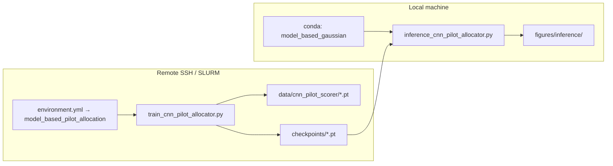

# CNN pilot allocator (Model A)

## Scope

The broader repo studies **pilot allocation** with model-based sequential LMMSE (`main.py`, `pilots.py`, `estimators.py`). This sub-project adds a **learned pilot scorer**: a 1D CNN over subcarriers that ranks unused subcarriers by predicted post-pilot log-MSE, deployed as `CNNPilotSampler` in closed-loop sequential LMMSE.

**Channel target:** Sionna **TDL-A** (static OFDM), not TDL-C/CDL in `experiment1`.

**Default geometry** (`TrainConfig` in `train_cnn_pilot_allocator.py`): `Na=16`, `Nc=32`, pilots `2 → 8` (+1/step) → **6 decision steps**, **7** MSE points (`T+1`).

**Companion skill:** [model-based-gaussian](../model-based-gaussian/SKILL.md) — vec(H) column-stacking, Kronecker prior, pilot-as-subcarrier indexing, LMMSE time indexing. Do not change those conventions here without updating both skills and pilot code.

## Entry points

| Role | File |
|------|------|
| Training, dataset cache, sweep CLI | `train_cnn_pilot_allocator.py` |
| Closed-loop MSE eval + plots | `inference_cnn_pilot_allocator.py` |
| Conda env | **Cluster:** `environment.yml` → `model_based_pilot_allocation`. **Local:** `model_based_gaussian` (do not use `environment.yml` locally unless recreating cluster env). |

**Shared imports** (do not reimplement): `data_generator`, `estimators`, `pilots`, `sionna_channels` (`sample_tdl_ofdm_channel`, `vec_from_H`, `SionnaOFDMGrid`, `empirical_covariance`).

CLI flags: see `parse_args()` in each entry script.

## Plans (read before sweep / infra changes)

- **Phase 0–1** (sanity, dataset cache, baseline train): `.cursor/plans/cnn_modelA_training_phase0-1_893b578f.plan.md`
- **Phase 2** (HP sweep, winners, closed-loop inference, gotchas): `.cursor/plans/cnn_modelA_training_phase_2_784c43b8.plan.md`

Phase 2 documents SLURM/GPU constraints, `CACHE_DATASET_META_KEYS` (excludes `huber_delta`), and checkpoint path pitfalls. Do not duplicate sweep tables in code comments—update the plan if history changes.

## Workflows



- **Training (cluster):** `conda env create -f environment.yml` once on the cluster login node → env name **`model_based_pilot_allocation`**; jobs use `conda activate model_based_pilot_allocation`. Commands: `sanity` | `train` | `sweep` | `sweep-pick`.
- **Inference (local):** `conda activate model_based_gaussian` — **`environment.yml` is for the cluster only**; local dev does not need that file if the env already exists. Needs only a `.pt` checkpoint (`load_checkpoint` reads weights + `cfg` + `model_arch`).

## Artifacts (gitignored)

| Path | Purpose |
|------|---------|
| `data/cnn_pilot_scorer/{train,val}.pt` | Cached `(X, y_label, loss_mask)` snapshots |
| `checkpoints/model_a_phase1_best.pt` | Phase 1 default best |
| `checkpoints/sweep/{run_id}/best.pt` | Sweep runs |
| `checkpoints/E0_best.pt`, `checkpoints/D2b_best.pt` | Default post-sweep comparison checkpoints |
| `figures/inference/` | PNG + JSON from inference |

## Model A essentials

- **`PilotScorerModelA`:** `(B, 7, Nc) → (B, Nc)`; default width 64, depth 3 (`NUM_FEATURE_CHANNELS = 7`).
- **Features** (`build_features`): per-SC z-scored `|H_hat|`, Re, Im; pilot mask; log-SNR; `t/T`; pilot fraction. No innovation/residual channel.
- **Labels:** counterfactual `log(empirical_MSE + eps)` on **unused** subcarriers; masked Huber loss; **top-1** = argmin pred vs argmin label on mask.
- **Dataset rollouts:** even channel seed → random pilot growth, odd → active (`active_subcarrier_score_J`); labels are always counterfactual.
- **Deploy:** `CNNPilotSampler.select_subcarrier` = argmin score on unused SCs. Inference uses `Sigma_hat` from TDL-A (`estimate_sigma_hat_tdl_a`) and the same sequential LMMSE stack as fixed/active baselines.
- **Checkpoint keys:** `model_state_dict`, `cfg`, `model_arch`, `best_epoch`, `best_val_huber`, `best_val_top1`.

## Inference

```bash
# Default: E0 vs D2b vs fixed/active
python inference_cnn_pilot_allocator.py --no-show

# Single checkpoint vs fixed/active
python inference_cnn_pilot_allocator.py --single --checkpoint checkpoints/model_a_phase1_best.pt --no-show
```

Seed offsets: `EVAL_CHANNEL_SEED_OFFSET`, `NOISE_SEED_OFFSET_*` in `inference_cnn_pilot_allocator.py`.

## Non-negotiables

- Inherit vec(H) and pilot indexing from **model-based-gaussian**; CNN code uses `pilots` / `estimators` APIs as-is.
- Do not change `CACHE_DATASET_META_KEYS` without regenerating `data/cnn_pilot_scorer/*.pt` (`--force-regen`).
- `inference_cnn_pilot_allocator.py` imports `TrainConfig`, `load_checkpoint`, `CNNPilotSampler` from training module—keep shared types in sync across both files.
- Cluster CUDA training expects sm_75+ GPUs; see Phase 2 plan if jobs fail on Pascal.
